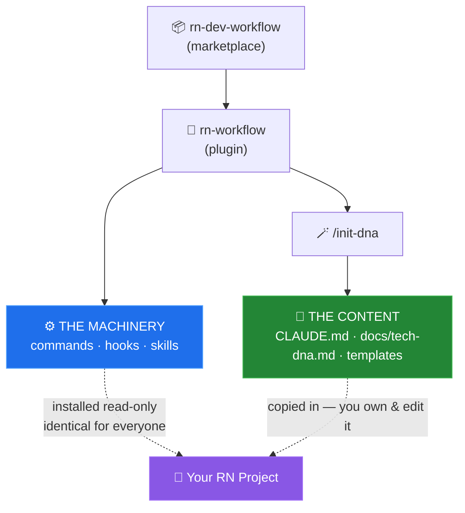
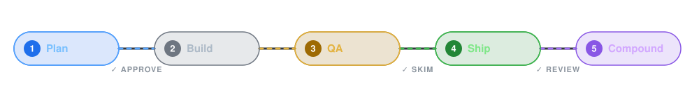
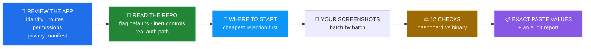

<div align="center">



<br/><br/>

**🦾 A drop-in AI development setup for React Native — installed with two commands.**

<p>
  
  
  
  
</p>
<p>
  
  
  
</p>

<sub>

[⚡ Quick Start](#-quick-start) · [🤔 Why](#-why-does-this-exist) · [🧩 Mental Model](#-how-its-built-the-mental-model) · [📚 What You Get](#-what-you-actually-get) · [✏️ Customize](#️-making-it-yours) · [❓ FAQ](#-faq--troubleshooting)

</sub>

</div>

---

Ever started a new React Native app and spent the first week re-deciding the same things? Folder structure, how data flows, how state is stored, how styling works, what *"done"* means, how the AI assistant should behave… **rn-dev-workflow makes all of that a one-time install instead of a per-project chore.**

It's a private [Claude Code](https://claude.com/claude-code) **plugin marketplace**. Install it once, run one command inside any RN project, and that project instantly gets:

- 🧬 A **tech-DNA** — the canonical *"how we build things here"* playbook, so every project reads the same way.
- ⚙️ Two guided **workflows** — `/feature` to build something end-to-end, `/fix` to squash a bug — each with checkpoints where **you** stay in control.
- 🛡️ **Guardrails** that run automatically — auto-lint on save, tests must pass before a task is *done*, and a confirm-prompt before touching risky files.
- 🎨 A **Figma → UI** skill and a 🕸️ **codebase knowledge-graph** skill.

> [!TIP]
> **New here?** Skip straight to [🚀 Quick Start](#-quick-start). Everything else is reference for later.

### ⚡ TL;DR — the whole thing in 5 lines

```bash
/plugin marketplace add parthil-savaliya-devx/rn-dev-workflow   # 1. add      (once per machine)
/plugin install rn-workflow@rn-dev-workflow                     # 2. install  (once per machine)
/init-dna                                                       # 3. scaffold (once per project)
/feature "add a wishlist screen"                                # 4. build 🎉
/store-submit                                                   # 5. ship 🛫
```

---

## 🤔 Why does this exist?

<table>
<tr>
<td width="50%" valign="top">

### 🎯 Consistency
A feature you write today and one a teammate writes in three months should look like the same person wrote them. That only happens if everyone copies the **same documented patterns** instead of improvising. That's the **tech-DNA**.

</td>
<td width="50%" valign="top">

### ⚡ No more setup fatigue
Copy-pasting `.claude/` folders and doc templates between repos is tedious and drifts out of sync. A **plugin** fixes this: install once, and improvements flow to every project when you update.

</td>
</tr>
</table>

---

## 🧩 How it's built (the mental model)

There are **two layers**, delivered two different ways. This is the one concept worth understanding:



| Layer | What it is | How you get it | Editable? |
| ----- | ---------- | -------------- | --------- |
| ⚙️ **Machinery** | `/feature` & `/fix`, the hooks, the skills | Installed as a **plugin** | ❌ Same for everyone — update centrally |
| 🧬 **Content** | `CLAUDE.md`, `docs/tech-dna.md`, templates | **Copied into your project** by `/init-dna` | ✅ **It's yours** — edit per project |

**In one line:** the plugin gives every project the same *engine*; the scaffold gives each project its own editable *rulebook*. 🏎️📖

---

## 🚀 Quick Start

<div align="center">

**Two commands to install · one to set up a project · then build.**

</div>

### 1️⃣ Add the marketplace *(once per machine)*
```
/plugin marketplace add parthil-savaliya-devx/rn-dev-workflow
```

### 2️⃣ Install the plugin *(once per machine)*
```
/plugin install rn-workflow@rn-dev-workflow
```
✨ `/feature`, `/fix`, the hooks, and the skills are now available everywhere.

### 3️⃣ Scaffold the docs into your project *(once per project)*
```
/init-dna
```
📥 Copies `CLAUDE.md` + a `docs/` folder into your repo. **Never overwrites** existing files.

### 4️⃣ Fill in the blanks
🔍 Search `docs/tech-dna.md` and `CLAUDE.md` for `<FILL IN>` markers — add your backend, env keys, fonts, etc. The best-practice rules are already written.

### 5️⃣ Build things 🎉
```
/feature "add a wishlist screen"
/fix "cart total is wrong when a coupon is applied"
```

---

## 📚 What you actually get

### ⚙️ The two workflows

<details open>
<summary><b>🛠️ <code>/feature "&lt;what you want&gt;"</code> — idea → PR, with 3 checkpoints</b></summary>

<br/>

<div align="center"></div>

<br/>

1. **📋 Plan** — explores your code, pulls Figma specs, asks *all* its questions at once, writes a plan + spec. → **you approve** ✋
2. **🔨 Build** — tests-first where there's logic, follows the tech-DNA, commits in small slices.
3. **🧪 QA & Verify** — lint + types + tests, drives the real app, screenshots each state. → **you skim** ✋
4. **🚢 Ship** — updates docs, opens the PR. → **you review** ✋
5. **🧠 Compound** — saves what it learned so it's never rediscovered.

</details>

<details>
<summary><b>🐛 <code>/fix "&lt;the bug&gt;"</code> — no ceremony, just discipline</b></summary>

<br/>

1. **🔬 Reproduce** it with a failing test first (no guessing).
2. **🔎 Investigate** and state the root cause (`file:line` + blast radius).
3. **✂️ Fix** with the smallest possible change.
4. **✅ Verify** everything's green.
5. **🚢 Ship** a PR with the root cause and evidence.

</details>

<details>
<summary><b>🪄 <code>/init-dna</code> — scaffolds the docs into your project</b></summary>

<br/>

The setup command from Quick Start step 3. Completely safe — it only **adds** files, asking before it touches anything that already exists.

</details>

> Both `/feature` and `/fix` **stop and ask** whenever something's unclear, and build *exactly* to your answer — they never guess. 🙌

<details>
<summary><b>🎬 What a <code>/feature</code> session actually feels like</b></summary>

<br/>

```text
you ▸ /feature "add a wishlist screen"

📋 Plan
   ├─ explores your code, reuses ProductCard + existing query patterns
   ├─ pulls the Figma node specs (exact spacing, colors → theme tokens)
   └─ asks 3 questions in one batch ..................... ✋ you approve

🔨 Build
   ├─ writes failing tests first (store · mapper · hook)
   ├─ builds the screen on the tech-DNA data pipeline
   └─ commits in small slices

🧪 QA & Verify
   ├─ lint ✓   typecheck ✓   tests ✓  (12 passed)
   ├─ drives the app, screenshots every state .......... ✋ you skim
   └─ fresh-eyes review pass

🚢 Ship
   └─ opens a PR with plan + tests + screenshots ........ ✋ you review

🧠 Compound
   └─ saved 1 gotcha to memory so it's never rediscovered
```

</details>

### 🛡️ The guardrails — they run on their own

You never call these; they just happen in the background:

| Guardrail | When | What it does |
| :-------: | ---- | ------------ |
| 🧹 **Auto-lint** | After every file edit | Runs `eslint --fix` on the file you just changed |
| ✅ **Test gate** | When a task finishes | Runs changed-file tests — a red suite blocks *done* |
| 🚧 **Native guard** | Before editing `ios/` / `android/` / generated files | Asks you to confirm — those edits are usually mistakes |
| 💡 **Learn nudge** | After a failed build/test | Suggests saving a non-obvious fix so it's never re-found |

➕ Destructive git (`push --force`, `reset --hard`, `clean -f`) is blocked, and `.env` edits ask first.

> [!NOTE]
> The hooks expect standard scripts — `yarn lint`, `yarn typecheck`, `yarn test`, `yarn check:env`. No `package.json` or different scripts? The hooks **quietly no-op** (they won't error) — but add those scripts for the full experience.

### 🎨 The skills

- **`figma-to-ui`** — turn a Figma node into React Native UI that follows your tech-DNA. Give it a Figma link + a screenshot.
- **`graphify`** — build a searchable knowledge graph of your codebase, so *"how does X work?"* is a fast query, not a grep marathon.
- **`store-submit`** — verify an App Store Connect submission against your actual code. → [full section below](#-shipping--store-submit)

### 🧬 The tech-DNA

The heart of it all — `docs/tech-dna.md`, a genome of copy-me patterns covering the data pipeline, state, styling, navigation, testing, and error handling. Ships as a **uniform baseline** (identical everywhere) with `<FILL IN>` slots for your specifics. Devs extend it as the project grows — that's expected, not cheating. 🌱

---

## 🛫 Shipping — `/store-submit`

Building is one problem. **Getting past App Review is another** — and it fails for a reason no
test catches: *the dashboard claims one thing, the binary does another.* Nobody diffs them,
because nobody can hold both in their head.

`/store-submit` reads your actual codebase and checks the submission against it.

> [!WARNING]
> **This one is a hard block, not a warning.** App Store Connect refuses *Add for Review* with:
> *"Your app contains `NSUserTrackingUsageDescription`, indicating that it may request permission
> to track users. To submit for review, update your App Privacy response…"*
>
> One grep of `Info.plist`, one dashboard answer. Entirely mechanical — and invisible until you
> try to submit. That's **check #1**.

### 🔬 How it runs

It reads your app and **reports the baseline back to you before asking for a single
screenshot** — then tells you which section to send first, and verifies each batch as it
arrives.



> [!IMPORTANT]
> **Report only.** It never edits your project. It tells you what's wrong, why, and the exact
> value to paste — you stay in control of every change.

It never answers a submission question from your marketing copy, a plausible default, or a
`docs/` note. Every answer is derived from code — and when a doc disagrees with the code,
**the code wins and you get told the doc is stale.** 📄❌

### ⚖️ The 12 checks


<table>
<tr><td width="50%" valign="top">

**🛑 Hard block**
| # | Check |
|---|-------|
| 1 | ATT key ⇄ tracking answer |

**💸 Costs a review cycle (~1 week each)**
| # | Check |
|---|-------|
| 2 | ASC version ⇄ `MARKETING_VERSION` |
| 3 | Device family ⇄ required screenshots |
| 4 | Privacy manifest ⇄ App Privacy answers |
| 5 | Description ⇄ feature flags + inert controls |
| 6 | Support URL isn't the privacy policy |

</td><td width="50%" valign="top">

**💸 …continued**
| # | Check |
|---|-------|
| 7 | UGC declared ⇄ moderation present |
| 8 | WebView guards ⇄ "unrestricted web access" |
| 9 | Deletion claim ⇄ backend reality |
| 10 | Keywords ⇄ live catalogue |
| 11 | Encryption key ⇄ export compliance |
| 12 | Permission prompts ⇄ declared data types |

> Each one is a documented App Review rejection cause — and each is derivable from code. 🎯

</td></tr>
</table>

### 🚀 Usage

```bash
/store-submit          # from inside any RN project
```

Then hand it screenshots as it asks. It works through the dashboard cheapest-rejection-first:
**App Review Info → App Privacy → App Information → Version info → Pricing → Build.**

<details>
<summary><b>🔍 What the evidence pass collects — automatically, before you show it anything</b></summary><br/>

Nine sections of mechanical ground truth, all fixed-location so it works on any RN repo:

| | |
| --- | --- |
| **Identity** | bundle id, `MARKETING_VERSION`, `CURRENT_PROJECT_VERSION` |
| **Device support** | `TARGETED_DEVICE_FAMILY`, Catalyst, visionOS |
| **Permission prompts** | every `NS*UsageDescription` — with its full string |
| **Encryption / ATT** | `ITSAppUsesNonExemptEncryption`, and the check-1 warning |
| **Privacy manifest** | parsed — types, purposes, linked + tracking flags |
| **Dependencies** | the full list — *you* classify what does analytics/ads, so no vendor list to go stale |
| **WebViews** | which ones are navigation-guarded, which are open |
| **Live URLs** | actually `curl`s them — a policy behind a password gate still returns 200 |

</details>

<details>
<summary><b>🧠 Why the project-specific bits are <i>read</i>, not grepped</b></summary><br/>

Feature-flag defaults, inert-control markers and the real auth path live wherever each project
puts them. A hardcoded grep that finds nothing looks **identical** to nothing to find — a silent
false negative, the worst possible failure for a submission tool.

So the script only collects what has a fixed location. Everything project-shaped is an
*instruction to explore the repo*. That's what makes it work on any RN app rather than one
particular stack.

Same reasoning killed the hardcoded analytics-SDK vendor list. A fixed list of vendor names goes
stale and can never catch an SDK that doesn't exist yet — so the script prints your dependencies
and the reader classifies them. Nothing to maintain.

The failure mode to watch for when adding a check: one that reports a clean result because it
looked in the wrong place. A plist picker that grabs a notification extension reports every
permission absent. A grep for a filename rather than an import matches unrelated files. Both
look like good news. **Run new checks against a real repo. Don't just review them.** 🧪

</details>

<details>
<summary><b>🌐 It checks live infrastructure too — not just code</b></summary><br/>

A field can hold a URL that looks perfect and is quietly broken. So:

- **`curl` every URL.** A privacy policy behind a store password gate still returns `200`.
- **Probe keywords against the store's own search** before accepting a keyword list. A term with
  zero products is irrelevant metadata (2.3.7) and wasted characters.
- **Check MX and SPF on any support email domain.** No MX record — or `v=spf1 -all` — means the
  address cannot receive mail, no matter how official it looks.
- **Distrust a probe that returns the same answer for every input.** If every URL pattern 404s,
  the probe is broken, not the answer. Say so and find another method. 🕵️

</details>

<details>
<summary><b>📋 What it hands back</b></summary><br/>

- **Exact values to paste** — keywords with character counts, the corrected description, review
  notes with a sign-in path that actually exists in your code
- **Verdict per field**, with the evidence line that settled it
- **A markdown report** — the paper trail for *"why did we answer No to tracking?"* six months later

</details>

> [!NOTE]
> `references/contradictions.md` is a **living file**. It encodes what Apple enforced on a real
> submission — and Apple changes the rules without notice. When someone hits a new blocker, it
> earns a numbered entry. That's the part that compounds. 📈

---

## ✏️ Making it yours

After `/init-dna`, everything under your project's `docs/` and `CLAUDE.md` belongs to **you**:

- 🖊️ **Fill the `<FILL IN>` slots** — backend, env keys, fonts, currency, integrations.
- 🗑️ **Delete what doesn't apply** — not commerce? Delete the money section. GraphQL-only? Delete the REST section.
- ➕ **Add new rules** as patterns emerge — document them in `tech-dna.md` in the same PR.
- 📜 **Record big changes** as ADRs in `docs/decisions/`.

---

## 🔄 Updating & maintaining

<table>
<tr>
<td width="50%" valign="top">

### 👤 As a user
Get the latest machinery:
```
/plugin marketplace update rn-dev-workflow
```
Your `docs/` are untouched — only commands/hooks/skills refresh.

</td>
<td width="50%" valign="top">

### 🛠️ As the maintainer
- **Command/hook/skill?** Edit here, bump `version` in `plugin.json`, push.
- **Baseline docs?** Edit `scaffold/`. New projects pick it up on next `/init-dna`.

</td>
</tr>
</table>

---

## 🗂️ What's in this repo

<details>
<summary><b>📁 Click to expand the repo layout</b></summary>

```
rn-dev-workflow/
├── .claude-plugin/
│   └── marketplace.json          # declares this marketplace + the plugin
└── plugins/rn-workflow/
    ├── .claude-plugin/plugin.json  # the plugin manifest
    ├── commands/                   # /feature, /fix, /init-dna
    ├── hooks/                      # the 4 guardrails + hooks.json
    ├── skills/                     # figma-to-ui, graphify, store-submit
    └── scaffold/                   # ← what /init-dna copies into your project
        ├── CLAUDE.md
        ├── settings.snippet.json
        └── docs/
            ├── tech-dna.md
            ├── decisions/          # ADR template + index
            ├── architecture/       # subsystem docs + the AI-workflow guide
            ├── superpowers/        # plan + spec templates
            ├── runbooks/
            └── glossary.md
```

</details>

---

## ❓ FAQ & troubleshooting

<details>
<summary><b>Do I need to run <code>/init-dna</code> in every project?</b></summary><br/>
Yes — once per project. It's what gives each repo its own editable rulebook.
</details>

<details>
<summary><b>Will <code>/init-dna</code> overwrite my existing <code>CLAUDE.md</code> or docs?</b></summary><br/>
No. It copies only files that don't already exist, and asks before merging into anything that does.
</details>

<details>
<summary><b>The commands don't show up after installing.</b></summary><br/>
Make sure both steps ran: <code>/plugin marketplace add …</code> <em>then</em> <code>/plugin install rn-workflow@rn-dev-workflow</code>. Commands are namespaced — try <code>/rn-workflow:feature</code> if bare <code>/feature</code> clashes with something else.
</details>

<details>
<summary><b>The hooks don't seem to do anything.</b></summary><br/>
They need <code>yarn lint</code> / <code>yarn typecheck</code> / <code>yarn test</code> / <code>yarn check:env</code> scripts in your <code>package.json</code>. No <code>package.json</code>? They safely no-op.
</details>

<details>
<summary><b>Can I use npm/pnpm instead of yarn?</b></summary><br/>
The hooks and command text default to <code>yarn</code>. Adjust the scripts in your project (or the hooks) to match your package manager.
</details>

<details>
<summary><b>Does <code>/store-submit</code> put anything in my app repo?</b></summary><br/>

**No.** It *reads* your codebase to derive answers, but it lives in `~/.claude/plugins/` — zero
files added to your project, nothing to commit or gitignore. Submission is a per-app, occasional
job, so the tooling shouldn't ship inside every app.

</details>

<details>
<summary><b>Do I need to re-install to get <code>/store-submit</code>?</b></summary><br/>

No — it's a skill inside the `rn-workflow` plugin you already have. One
`/plugin marketplace update rn-dev-workflow` and it's there.

</details>

<details>
<summary><b>I want this private, not public.</b></summary><br/>
Flip the repo to private in GitHub settings — the install commands stay identical; teammates just need repo access and a <code>gh</code> login.
</details>

<div align="center"></div>

<div align="center">

**Built with [Claude Code](https://claude.com/claude-code) 🤖 · Contributions and rule-tweaks welcome — open a PR!**

<sub>⭐ If this saved you a week of project setup, drop a star.</sub>

</div>
