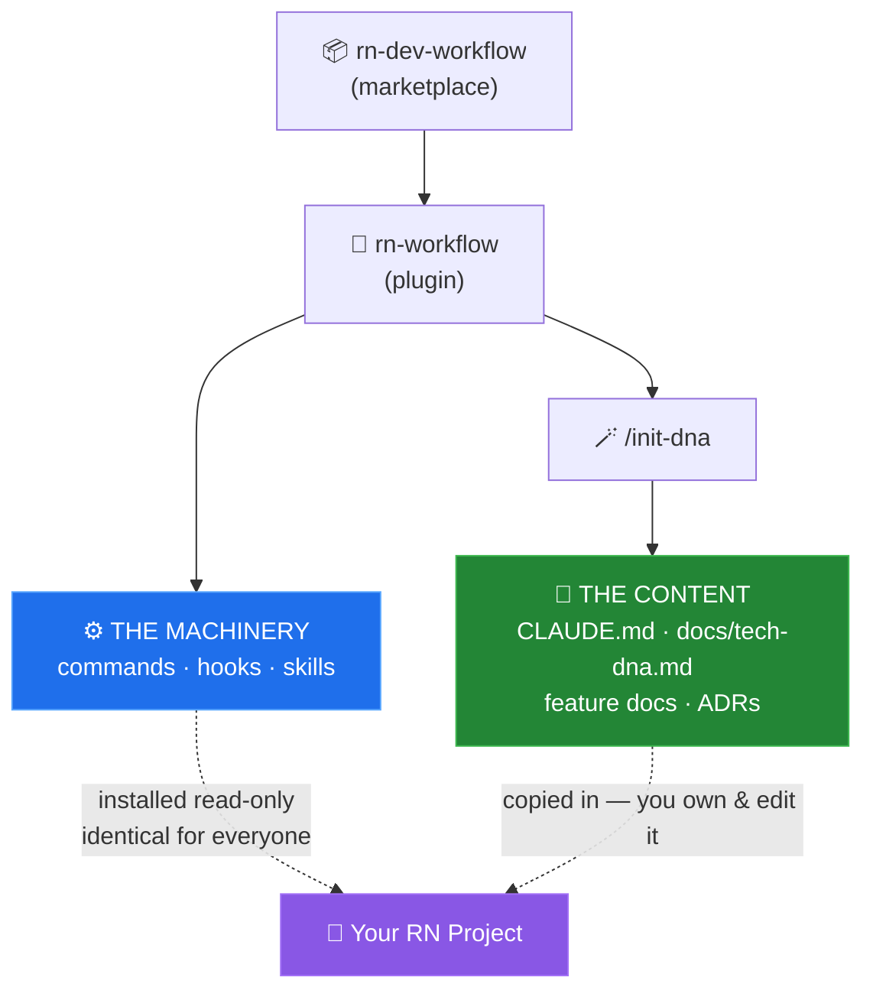
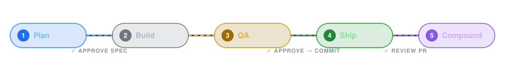
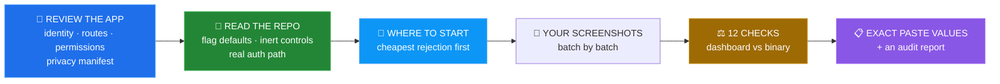

<div align="center">



<br/><br/>

**🦾 A drop-in AI development setup for React Native — installed with two commands.**

<p>
  
  
  
  
</p>
<p>
  
  
  
</p>

<sub>

[⚡ Quick Start](#-quick-start) · [🤔 Why](#-why-does-this-exist) · [🧩 Mental Model](#-how-its-built-the-mental-model) · [🔁 How It Runs](#-how-it-runs--the-automated-flow) · [📚 What You Get](#-what-you-actually-get) · [📂 Feature Docs](#-feature-docs--every-decision-on-record) · [🛫 Shipping](#-shipping--store-submit) · [✏️ Customize](#️-making-it-yours) · [❓ FAQ](#-faq--troubleshooting)

</sub>

</div>

---

Ever started a new React Native app and spent the first week re-deciding the same things? Folder structure, how data flows, how state is stored, how styling works, what *"done"* means, how the AI assistant should behave… **rn-dev-workflow makes all of that a one-time install instead of a per-project chore.**

It's a private [Claude Code](https://claude.com/claude-code) **plugin marketplace**. Install it once, run one command inside any RN project, and that project instantly gets:

- 🧬 A **tech-DNA** — the canonical *"how we build things here"* playbook, so every project reads the same way.
- ⚙️ Two guided **workflows** — `/feature` to build something end-to-end, `/fix` to squash a bug — each with checkpoints where **you** stay in control. Nothing is committed until you approve it.
- 📂 **Feature docs, written as you go** — every question asked, your answer, and every decision with **who decided, who approved and when**, in `docs/modules/`. Nothing is guessed, nothing is vibe-coded.
- 🛡️ **Guardrails** that run automatically — lint after every edit, tests must pass before a task is *done*, a doc-format check, and a confirm-prompt before touching native files. Built so they can't freeze your machine.
- 🎨 A **Figma → UI** skill and a 🕸️ **codebase knowledge-graph** skill.
- 🛫 A **submission reviewer** — `/store-submit` checks your App Store / Play listing against what the code actually does, before a reviewer does it for you.

> [!TIP]
> **New here?** Skip straight to [🚀 Quick Start](#-quick-start). Everything else is reference for later.

### ⚡ TL;DR — the whole thing in 5 lines

```bash
/plugin marketplace add parthil-savaliya-devx/rn-dev-workflow   # 1. add      (once per machine)
/plugin install rn-workflow@rn-dev-workflow                     # 2. install  (once per machine)
/init-dna                                                       # 3. scaffold (once per project)
/feature "add a wishlist screen"                                # 4. build 🎉 (asks · documents · tests · PRs)
/store-submit                                                   # 5. ship 🛫
```

---

## 🤔 Why does this exist?

<table>
<tr>
<td width="50%" valign="top">

### 🎯 Consistency
A feature you write today and one a teammate writes in three months should look like the same person wrote them. That only happens if everyone copies the **same documented patterns** instead of improvising. That's the **tech-DNA**.

</td>
<td width="50%" valign="top">

### ⚡ No more setup fatigue
Copy-pasting `.claude/` folders and doc templates between repos is tedious and drifts out of sync. A **plugin** fixes this: install once, and improvements flow to every project when you update.

</td>
</tr>
</table>

---

## 🧩 How it's built (the mental model)

There are **two layers**, delivered two different ways. This is the one concept worth understanding:


```mermaid
flowchart TD
    M["📦 rn-dev-workflow<br/>(marketplace)"] --> P["🔌 rn-workflow<br/>(plugin)"]
    P --> ENGINE["⚙️ THE MACHINERY<br/>commands · hooks · skills"]
    P --> INIT["🪄 /init-dna"]
    INIT --> DOCS["🧬 THE CONTENT<br/>CLAUDE.md · docs/tech-dna.md<br/>feature docs · ADRs"]
    ENGINE -.->|installed read-only<br/>identical for everyone| REPO["📱 Your RN Project"]
    DOCS -.->|copied in — you own & edit it| REPO

    style ENGINE fill:#1f6feb,stroke:#58a6ff,color:#fff
    style DOCS fill:#238636,stroke:#3fb950,color:#fff
    style REPO fill:#8957e5,stroke:#a371f7,color:#fff
```

| Layer | What it is | How you get it | Editable? |
| ----- | ---------- | -------------- | --------- |
| ⚙️ **Machinery** | `/feature`, `/fix`, `/doc:*`, the hooks, the skills, the doc templates | Installed as a **plugin** | ❌ Same for everyone — update centrally |
| 🧬 **Content** | `CLAUDE.md`, `docs/tech-dna.md`, `docs/modules/` (feature docs), `docs/decisions/` (ADRs) | **Copied into your project** by `/init-dna`, then grows as you build | ✅ **It's yours** — edit per project |

**In one line:** the plugin gives every project the same *engine*; the scaffold gives each project its own editable *rulebook*. 🏎️📖

---

## 🚀 Quick Start

<div align="center">

**Two commands to install · one to set up a project · then build.**

</div>

### 1️⃣ Add the marketplace *(once per machine)*
```
/plugin marketplace add parthil-savaliya-devx/rn-dev-workflow
```

### 2️⃣ Install the plugin *(once per machine)*
```
/plugin install rn-workflow@rn-dev-workflow
```
✨ `/feature`, `/fix`, `/doc:*`, the hooks, and the skills are now available everywhere.

### 3️⃣ Scaffold the docs into your project *(once per project)*
```
/init-dna
```
📥 Copies `CLAUDE.md` + a `docs/` folder into your repo, adds the safe-git permissions, and maps the workflow's command names to your real scripts. **Never overwrites** existing files and **never commits** — you review and commit it.

### 4️⃣ Fill in the blanks
🔍 Search `docs/tech-dna.md` and `CLAUDE.md` for `<FILL IN>` markers — add your backend, env keys, fonts, etc. The best-practice rules are already written.

### 5️⃣ Build things 🎉
```
/feature "add a wishlist screen"                      # plan → build → QA → PR, docs included
/fix "cart total is wrong when a coupon is applied"   # repro test → minimal fix → logged in the feature's spec
/doc:new cart apply-coupon                            # document a feature on its own
```

---

## 🔁 How it runs — the automated flow

You give **one command**. Claude walks the steps, the hooks check its work **on their own**, and **you approve at three gates**. Here's `/feature` end to end:

<div align="center"></div>

| Step | 🤖 Claude does it (the command) | 🛡️ Runs on its own (hooks) | 🙋 You |
| ---- | ------------------------------- | -------------------------- | ------ |
| 📋 **Plan** | Reads the tech-DNA, your code, the Figma nodes and the API contract. Asks every open question **one at a time, with options**. Drafts the feature's `spec.md` + `build.md` — status **Draft**. | 📂 Doc check at the end of any turn that changed the docs | Answer each question · OK each write · **✋ Gate A: approve the spec** — you name the approver, status → **Approved** |
| 🔨 **Build** | Tests first where there's logic, code on the tech-DNA patterns, a `testID` on every element, `build.md` checkboxes ticked — status **Building**. **Nothing is committed.** | 🧹 eslint after every edit · 🚧 confirm before `ios/` / `android/` · ✅ changed-file tests at the end of every turn | Answer if something new comes up — it's recorded as a new decision, never a silent change |
| 🧪 **QA & Verify** | Green bar (lint · types · tests · env), drives the real app and screenshots every state, fresh-eyes review, fills the spec's **Proof** column, runs `/doc:check`. | 💡 a failed check → nudge to save the fix | **✋ Gate B: approve the change — only then is it committed** |
| 🚢 **Ship** | Pushes, opens the PR with the docs + evidence, adds the PR link to the spec. | 💡 after the commit → nudge to save what was learned | **✋ Gate C: review the PR** · confirm the merge → status **Shipped** |
| 🧠 **Compound** | Saves non-obvious gotchas to memory; proposes a `/hookify` rule for a mistake that could repeat. | | |

`/fix` runs the same way, just smaller: **repro test → root cause → minimal fix → green bar → you approve → commit**, and the bug is logged in that feature's spec → *Bugs fixed*. It pushes and opens the PR when you say so.

> [!IMPORTANT]
> **Three rules hold at every step:**
> 1. Anything unclear → it **stops and asks** — one question at a time, with options — and builds exactly to your answer. It never guesses.
> 2. **Nothing is written** to code or docs without your OK.
> 3. **Nothing is committed** before you approve the change.

---

## 📚 What you actually get

### ⚙️ The two workflows

<details open>
<summary><b>🛠️ <code>/feature "&lt;what you want&gt;"</code> — idea → PR, with 3 checkpoints</b></summary>

<br/>

1. **📋 Plan** — explores your code (reusing `components/core/` and `components/common/` first), pulls the Figma specs, gets the API contract, and asks its questions **one at a time, with options** — edge cases included (empty, error, offline, double tap, large text, 3-button nav…). Writes the feature's `spec.md` + `build.md` once you OK them. → **you approve the spec** ✋
2. **🔨 Build** — tests-first where there's logic, follows the tech-DNA. **Nothing is committed yet.**
3. **🧪 QA & Verify** — lint (`--max-warnings=0`) + types + tests + env check, drives the real app and screenshots each state — 3-button nav, screen reader, largest font and a low-end Android included — then a fresh-eyes review. Device e2e runs only if you say yes, and only for this feature. → **you approve the change — only then is it committed** ✋
4. **🚢 Ship** — pushes and opens the PR (docs + evidence included). → **you review** ✋
5. **🧠 Compound** — saves what it learned so it's never rediscovered.

</details>

<details>
<summary><b>🐛 <code>/fix "&lt;the bug&gt;"</code> — no ceremony, just discipline</b></summary>

<br/>

1. **🔬 Reproduce** it with a failing test first (no guessing). Can't reproduce it? It stops and tells you what it tried.
2. **🔎 Investigate** — checks memory and the known silent traps, then states the root cause (`file:line` + blast radius). Not sure? It asks.
3. **✂️ Fix** with the smallest possible change, then sweeps for the same bug elsewhere.
4. **✅ Verify** — the green bar; before/after screenshots for a visual bug.
5. **🚢 Ship** — logs the bug in the feature's spec (*Bugs fixed*: what broke, root cause, fix, who decided, who approved) and shows you the change → **you approve → it's committed**. It pushes and opens the PR when you say so.
6. **🧠 Compound** — a non-obvious root cause goes to memory; a mistake that could repeat gets a `/hookify` rule.

</details>

<details>
<summary><b>🪄 <code>/init-dna</code> — sets up a project</b></summary>

<br/>

The setup command from Quick Start step 3. Completely safe — it only **adds**, and asks before it touches anything that already exists:

- copies `CLAUDE.md` and the `docs/` tree (tech-DNA, feature-docs index, ADR template, AI-workflow guide), skipping files you already have;
- merges the safe-git and `.env` permissions into `.claude/settings.json`;
- maps `lint`, `typecheck`, `test`, `check:env`, `ios:dev`, `android:dev` to your real scripts — adds alias scripts or writes your names into `CLAUDE.md`, your choice;
- finds old in-repo copies of the hooks and offers to remove them, so nothing runs twice;
- lists every `<FILL IN>` slot left for you. It never commits.

</details>

<details>
<summary><b>🎬 What a <code>/feature</code> session actually feels like</b></summary>

<br/>

```text
you ▸ /feature "add a wishlist screen"

📋 Plan
   ├─ explores your code, reuses ProductCard + existing query patterns
   ├─ pulls the Figma node specs (exact spacing, colors → theme tokens)
   ├─ asks 3 questions, one at a time, with options
   ├─ shows docs/modules/wishlist/wishlist-screen/spec.md + build.md → writes on your OK
   └─ ✋ you approve the spec (you pick the approver) ....... status: Approved

🔨 Build ................................................... status: Building
   ├─ writes failing tests first (store · mapper · hook)
   ├─ builds the screen on the tech-DNA data pipeline
   ├─ 🛡️ eslint after each edit · changed-file tests at the end of each turn
   └─ keeps the change uncommitted for your review

🧪 QA & Verify
   ├─ lint ✓   typecheck ✓   tests ✓ (12 passed)   env ✓
   ├─ drives the app, screenshots every state
   ├─ fresh-eyes review pass
   ├─ fills the spec's Proof column · doc check ✓
   └─ shows you the change ........................... ✋ you approve → commit

🚢 Ship
   ├─ opens a PR with spec + tests + screenshots ....... ✋ you review
   └─ you confirm the merge ............................ status: Shipped

🧠 Compound
   └─ saved 1 gotcha to memory so it's never rediscovered
```

</details>

### 🛡️ The guardrails — they run on their own

You never call these; they just happen in the background:

| Guardrail | When | What it does |
| :-------: | ---- | ------------ |
| 🧹 **Auto-lint** | After every edit Claude makes | Runs your `eslint --fix` on that file; an error it can't fix goes back to Claude |
| ✅ **Test gate** | When a turn ends | Runs the tests for changed files — a red suite blocks *done*. Skipped when nothing changed since the last green run |
| 🚧 **Native guard** | Before editing `ios/` / `android/` / generated files | Asks you to confirm — those edits are usually mistakes |
| 📂 **Doc check** | When a turn ends, if feature docs changed | Checks the format — sections, IDs, who decided / approved / when, the index — a messy doc blocks *done* |
| 💡 **Learn nudge** | After a failed lint / test / build, and after a commit | Reminds Claude to save a non-obvious fix to memory or a `/hookify` rule |

➕ From `.claude/settings.json` (added by `/init-dna`): destructive git (`push --force`, `reset --hard`, `clean -f`) is blocked, and `.env` edits ask first.

> [!NOTE]
> The hooks run your project's own `eslint` and `jest` (from `node_modules/.bin`), so they work with yarn, npm or pnpm. No `package.json`, or eslint / jest not installed? They **quietly no-op**. `/init-dna` maps the workflow's command names (`lint`, `typecheck`, `test`, `check:env`, `ios:dev`, `android:dev`) to your real scripts.

> [!TIP]
> **The hooks can't freeze your machine**, even on broken code. eslint and jest run one at a time, with a memory cap and a time limit, and when they're stopped *every* process they started is killed too. Tests are skipped when nothing changed since the last green run.

### 🎨 The skills

- **`figma-to-ui`** — turn a Figma node into React Native UI that follows your tech-DNA. Give it a Figma link + a screenshot.
- **`graphify`** — build a searchable knowledge graph of your codebase, so *"how does X work?"* is a fast query, not a grep marathon.
- **`doc`** — the feature docs: one folder per feature, every question and decision with **who decided, who approved, when**. `/feature` and `/fix` use it automatically; `/doc:new`, `/doc:update`, `/doc:check` to use it directly. → [full section below](#-feature-docs--every-decision-on-record)
- **`store-submit`** — verify an App Store Connect *and* Play Console submission against your actual code. `/store-submit` does both; scope it with `:ios` / `:android`. → [full section below](#-shipping--store-submit)

### 🧬 The tech-DNA

The heart of it all — `docs/tech-dna.md`, a genome of copy-me patterns (§0–§29):

| Area | What it fixes in place |
| ---- | ---------------------- |
| 🏗️ **Structure** | folder anatomy · components in `core/` · `common/` · `components/<area>/` · reuse project components before React Native primitives |
| ✍️ **Code** | naming & TypeScript · React & hooks rules · forms & keyboard · error handling |
| 🔌 **Data** | the boundary pipeline (timeout, Zod schema, mapper firewall) · contracts · React Query · Zustand + MMKV with versioned persisted stores |
| 🎨 **UI** | theme tokens only · Figma precision · overlays & bottom sheets · accessibility (screen reader, large text) · **edge-to-edge** — nothing under the status bar or 3-button navigation |
| ⚡ **Performance** | smooth on **2–4 GB RAM phones** · media sized by screen width + aspect ratio, never hardcoded · **Reanimated only** for animation · lists, images, bundle size |
| 🔒 **Cross-cutting** | security · auth & session · permissions · SDKs · app lifecycle · release & native config · analytics & privacy |
| ✅ **Process** | tests · docs in the same PR · **you approve before every commit** · lint with zero warnings · a release checklist · an index of **failures that are silent** (no error, no failing test) |

`CLAUDE.md` carries the hard rules and the top silent traps, so they're read before every task.

Ships as a **uniform baseline** (identical everywhere) with `<FILL IN>` slots for your specifics. Core libraries (Reanimated, gesture-handler, safe-area, keyboard-controller, keychain, …) are hard rules; optional integrations (video, WebView, remote config, crash reporting, analytics, OTA) are marked _"If your app uses X"_. Devs extend it as the project grows — that's expected, not cheating. 🌱

---

## 📂 Feature docs — every decision on record

Every feature gets **one folder** with **two files**, in one fixed format. Open any feature and you can see what was asked, what the developer answered, what was decided — and **who decided, who approved, and when**. Nothing is guessed; nothing is vibe-coded.

```
docs/modules/
├── README.md              ← index: every feature · status · owner · updated
└── cart/                  ← one folder per code area (same name as src/components/cart/)
    ├── README.md          ← what this area does + its features
    └── apply-coupon/      ← one folder per feature
        ├── spec.md        ← WHAT & WHY — this is what you approve
        └── build.md       ← HOW — how it was built and checked
```

<table>
<tr><td width="55%" valign="top">

**📄 `spec.md` — what & why**
| # | Section |
|---|---------|
| 1 | Summary — goal · in scope · out of scope |
| 2 | Questions & answers — in the dev's own words |
| 3 | Decisions — why · decided by · approved by · date |
| 4 | Requirements — each with its proof |
| 5 | Edge cases — each with its proof |
| 6 | Bugs fixed — root cause · fix · who · PR |
| 7 | Changelog |

</td><td width="45%" valign="top">

**🛠️ `build.md` — how**
| # | Section |
|---|---------|
| 1 | Design values (Figma node per state) |
| 2 | Files — each with its job |
| 3 | testIDs |
| 4 | Plan — `- [ ]` checkboxes |
| 5 | Verification — result · evidence |

</td></tr>
</table>

**What a decision looks like** — every row says where it came from and who signed it off:

| # | Decision | Why | Decided by | Approved by | Date | From |
|---|----------|-----|------------|-------------|------|------|
| D1 | An invalid code shows an inline error | Keeps the error next to the field | @dev | @lead | 2026-10-01 | Q1 |

**Status** moves one way: **Draft** (questions being asked) → **Approved** (you approved the spec) → **Building** (code started) → **Shipped** (you confirmed the merge) → **Retired** (removed or replaced).

<details open>
<summary><b>📏 The rules the doc skill never breaks</b></summary><br/>

- Asks **one question at a time**, with options — never a list of questions.
- **Writes nothing without your OK** — it shows you the exact rows first.
- **Decided by** = your git name. **Approved by** is asked every time, with git names as the options.
- IDs (`Q1`, `D1`, `R1`, `E1`, `B1`) are never reused. A changed decision is a **new** row and the old one is marked *superseded* — history is never deleted or rewritten.
- **Proof** is something you can open — a test name or a screenshot path — never just "done".
- App-wide decisions (a library, an architecture rule) are ADRs in `docs/decisions/`; the feature links to them.

</details>

**How the docs stay up to date** — the workflow fills them in at each step, always after your OK:

| When | What happens to the docs |
| ---- | ------------------------ |
| `/feature` → Plan | `spec.md` + `build.md` are created (**Draft**); Gate A → **Approved** |
| `/feature` → Build | status **Building**; files, testIDs and plan checkboxes are filled in |
| `/feature` → QA & Ship | the Proof column and Verification are filled; the PR link and a Changelog row are added |
| `/fix` | the bug becomes a row in that feature's *Bugs fixed* |
| any turn that touched `docs/modules/` | 📂 the doc check runs — a broken format blocks *done* |

| Command | Use it to |
| ------- | --------- |
| `/doc:new <module> <feature>` | document a feature on its own — asks first, then writes |
| `/doc:update <feature>` | add a question, decision, requirement, edge case, bug or status change |
| `/doc:check` | check every feature doc — reports problems, fixes only after you confirm |

---

## 🛫 Shipping — `/store-submit`

<div align="center">

**`/store-submit`** · **`:ios`** · **`:android`**

<sub>12 checks · dashboard vs binary · report-only</sub>

</div>

Building is one problem. **Getting past store review is another** — and it fails for a reason no
test catches: *the dashboard claims one thing, the binary does another.* Nobody diffs them,
because nobody can hold both in their head.

`/store-submit` reads your actual codebase and checks the submission against it.

> [!WARNING]
> **This one is a hard block, not a warning.** App Store Connect refuses *Add for Review* with:
> *"Your app contains `NSUserTrackingUsageDescription`, indicating that it may request permission
> to track users. To submit for review, update your App Privacy response…"*
>
> One grep of `Info.plist`, one dashboard answer. Entirely mechanical — and invisible until you
> try to submit. That's **check #1**.

### 🔬 How it runs

It reads your app and **reports the baseline back to you before asking for a single
screenshot** — then tells you which section to send first, and verifies each batch as it
arrives.


```mermaid
flowchart LR
    A["🔬 REVIEW THE APP<br/>identity · routes · permissions<br/>privacy manifest"] --> B["📖 READ THE REPO<br/>flag defaults · inert controls<br/>real auth path"]
    B --> C["🧭 WHERE TO START<br/>cheapest rejection first"]
    C --> D["📸 YOUR SCREENSHOTS<br/>batch by batch"]
    D --> E["⚖️ 12 CHECKS<br/>dashboard vs binary"]
    E --> F["📋 EXACT PASTE VALUES<br/>+ an audit report"]

    style A fill:#1f6feb,stroke:#58a6ff,color:#fff
    style B fill:#238636,stroke:#3fb950,color:#fff
    style C fill:#0d96f6,stroke:#58a6ff,color:#fff
    style E fill:#9e6a03,stroke:#d29922,color:#fff
    style F fill:#8957e5,stroke:#a371f7,color:#fff
```

> [!IMPORTANT]
> **Report only.** It never edits your project. It tells you what's wrong, why, and the exact
> value to paste — you stay in control of every change.

It never answers a submission question from your marketing copy, a plausible default, or a
`docs/` note. Every answer is derived from code — and when a doc disagrees with the code,
**the code wins and you get told the doc is stale.** 📄❌

### ⚖️ The 12 checks


<table>
<tr><td width="50%" valign="top">

**🛑 Hard block**
| # | Check |
|---|-------|
| 1 | ATT key ⇄ tracking answer |

**💸 Costs a review cycle (~1 week each)**
| # | Check |
|---|-------|
| 2 | ASC version ⇄ `MARKETING_VERSION` |
| 3 | Device family ⇄ required screenshots |
| 4 | Privacy manifest ⇄ App Privacy answers |
| 5 | Description ⇄ feature flags + inert controls |
| 6 | Support URL isn't the privacy policy |

</td><td width="50%" valign="top">

**💸 …continued**
| # | Check |
|---|-------|
| 7 | UGC declared ⇄ moderation present |
| 8 | WebView guards ⇄ "unrestricted web access" |
| 9 | Deletion claim ⇄ backend reality |
| 10 | Keywords ⇄ live catalogue |
| 11 | Encryption key ⇄ export compliance |
| 12 | Permission prompts ⇄ declared data types |

> Each one is a documented store rejection cause — and each is derivable from code. 🎯
>
> **5, 7, 8, 9, 10** are app-truth questions and apply to **both** stores unchanged. A feature
> that doesn't exist is missing from both listings.

</td></tr>
</table>

### 🚀 Usage

```bash
/store-submit                  # both — iOS to completion, then Android
/store-submit:ios              # App Store Connect only
/store-submit:android          # Play Console only
```

> [!IMPORTANT]
> **The default run is sequenced, not interleaved.** iOS finishes entirely — every section verified,
> open items listed — then it asks before starting Android, and closes by diffing the two
> declarations against each other.
>
> Why: the two consoles ask different questions in different words, and answering them side by
> side is exactly how one fact ends up declared one way on one store and another way on the
> other. Finish one, then carry its **evidence** — never its answers — into the next.

Then hand it screenshots as it asks. It works the console cheapest-rejection-first:

| | Order |
| --- | --- |
| 🍎 **iOS** | App Review Info → App Privacy → App Information + Age Rating → Version info → Pricing → Build |
| 🤖 **Android** | App access → Data safety → Content rating → Store listing → Advertising ID → Countries → Release |

Send the first two together — those carry the real blockers.

> [!TIP]
> **The diff is worth it even if you only ship one store today.** A data type declared on one
> console and not the other means one of them is factually wrong. Play's *Shared* flag and its
> Fraud-prevention / Account-management purposes have no Apple equivalent, so the skill reports
> genuine disagreements and ignores taxonomy differences.

<details>
<summary><b>🔍 What the evidence pass collects — automatically, before you show it anything</b></summary><br/>

Mechanical ground truth, all fixed-location so it works on any RN repo. Platform-gated —
`--platform ios|android|both`:

| | |
| --- | --- |
| 🍎 **Identity** | bundle id, `MARKETING_VERSION`, `CURRENT_PROJECT_VERSION` |
| 🍎 **Device support** | `TARGETED_DEVICE_FAMILY`, Catalyst, visionOS |
| 🍎 **Permission prompts** | every `NS*UsageDescription` — with its full string |
| 🍎 **Encryption / ATT** | `ITSAppUsesNonExemptEncryption`, and the check-1 warning |
| 🍎 **Privacy manifest** | parsed — types, purposes, linked + tracking flags |
| 🤖 **Android identity** | `applicationId`, `versionCode`, `versionName` |
| 🤖 **Android permissions** | every manifest permission, plus whether `AD_ID` is declared |
| 🤖 **Signing** | Play re-signs, so SHA-restricted services need *both* fingerprints |
| **Dependencies** | the full list — *you* classify what does analytics/ads, so no vendor list to go stale |
| **WebViews** | which ones are navigation-guarded, which are open |
| **Live URLs** | actually `curl`s them — a policy behind a password gate still returns 200 |

</details>

<details>
<summary><b>🧠 Why the project-specific bits are <i>read</i>, not grepped</b></summary><br/>

Feature-flag defaults, inert-control markers and the real auth path live wherever each project
puts them. A hardcoded grep that finds nothing looks **identical** to nothing to find — a silent
false negative, the worst possible failure for a submission tool.

So the script only collects what has a fixed location. Everything project-shaped is an
*instruction to explore the repo*. That's what makes it work on any RN app rather than one
particular stack.

Same reasoning killed the hardcoded analytics-SDK vendor list. A fixed list of vendor names goes
stale and can never catch an SDK that doesn't exist yet — so the script prints your dependencies
and the reader classifies them. Nothing to maintain.

The failure mode to watch for when adding a check: one that reports a clean result because it
looked in the wrong place. A plist picker that grabs a notification extension reports every
permission absent. A grep for a filename rather than an import matches unrelated files. Both
look like good news. **Run new checks against a real repo. Don't just review them.** 🧪

</details>

<details>
<summary><b>🌐 It checks live infrastructure too — not just code</b></summary><br/>

A field can hold a URL that looks perfect and is quietly broken. So:

- **`curl` every URL.** A privacy policy behind a store password gate still returns `200`.
- **Probe keywords against the store's own search** before accepting a keyword list. A term with
  zero products is irrelevant metadata (2.3.7) and wasted characters.
- **Check MX and SPF on any support email domain.** No MX record — or `v=spf1 -all` — means the
  address cannot receive mail, no matter how official it looks.
- **Distrust a probe that returns the same answer for every input.** If every URL pattern 404s,
  the probe is broken, not the answer. Say so and find another method. 🕵️

</details>

<details>
<summary><b>📋 What it hands back</b></summary><br/>

- **Exact values to paste** — keywords with character counts, the corrected description, review
  notes with a sign-in path that actually exists in your code
- **Verdict per field**, with the evidence line that settled it
- **A markdown report** — the paper trail for *"why did we answer No to tracking?"* six months later

</details>

> [!NOTE]
> `references/contradictions.md` is a **living file**. It encodes what Apple enforced on a real
> submission — and Apple changes the rules without notice. When someone hits a new blocker, it
> earns a numbered entry. That's the part that compounds. 📈

---

## ✏️ Making it yours

After `/init-dna`, everything under your project's `docs/` and `CLAUDE.md` belongs to **you**:

- 🖊️ **Fill the `<FILL IN>` slots** — backend, env keys, fonts, currency, integrations.
- 🗑️ **Delete what doesn't apply** — not commerce? Delete the money section (§13a). GraphQL-only? Delete the REST section (§20). No sign-in? Delete auth & session (§23).
- ➕ **Add new rules** as patterns emerge — document them in `tech-dna.md` in the same PR.
- 📜 **Record app-wide decisions** as ADRs in `docs/decisions/`; feature decisions live in that feature's `spec.md`.

---

## 🔄 Updating & maintaining

<table>
<tr>
<td width="50%" valign="top">

### 👤 As a user
Get the latest machinery — **two steps**, in a terminal:
```bash
claude plugin marketplace update rn-dev-workflow   # 1. fetch the latest catalog
claude plugin update rn-workflow@rn-dev-workflow    # 2. install the new version
```
Then **restart Claude Code** so the new hooks load. Step 1 alone does *not* update the plugin. Your `docs/` are untouched — only commands, hooks and skills refresh.

New baseline rules don't reach a project that's already set up. Run `/init-dna` there and pick **diff against the current template** to pull them in.

</td>
<td width="50%" valign="top">

### 🛠️ As the maintainer
- **Command/hook/skill?** Edit here, bump `version` in **both** `plugin.json` and `marketplace.json`, push.
- **Baseline docs?** Edit `scaffold/`. New projects pick it up on the next `/init-dna`.
- **Never** put one project's names or data in here — the plugin stays generic.

</td>
</tr>
</table>

---

## 🗂️ What's in this repo

<details>
<summary><b>📁 Click to expand the repo layout</b></summary>

```
rn-dev-workflow/
├── .claude-plugin/
│   └── marketplace.json          # declares this marketplace + the plugin
├── assets/                       # README images (banner, flow)
└── plugins/rn-workflow/
    ├── .claude-plugin/plugin.json  # the plugin manifest
    ├── commands/                   # /feature, /fix, /init-dna, /doc:(new|update|check), /store-submit(:ios|:android)
    ├── hooks/                      # the 5 guardrails + hooks.json; lib/ = the bounded runner (lock · memory cap · tree kill)
    ├── skills/
    │   ├── figma-to-ui/            # Figma node → RN UI on the tech-DNA patterns
    │   ├── graphify/               # codebase knowledge graph
    │   ├── doc/                    # feature docs: templates/ (spec, build, READMEs) + scripts/doc-check.mjs
    │   └── store-submit/           # App Store / Play submission review
    └── scaffold/                   # ← what /init-dna copies into your project
        ├── CLAUDE.md               # hard rules · silent traps · commands · subsystem map
        ├── settings.snippet.json   # safe-git + .env permissions
        └── docs/
            ├── README.md           # map of the docs
            ├── tech-dna.md         # the rulebook (§0–§29)
            ├── decisions/          # ADR template + index (app-wide decisions)
            ├── architecture/       # subsystem docs + the AI-workflow guide
            ├── modules/            # feature docs index → <module>/<feature>/spec.md + build.md
            ├── runbooks/
            └── glossary.md
```

</details>

---

## ❓ FAQ & troubleshooting

<details>
<summary><b>Do I need to run <code>/init-dna</code> in every project?</b></summary><br/>
Yes — once per project. It's what gives each repo its own editable rulebook.
</details>

<details>
<summary><b>Will <code>/init-dna</code> overwrite my existing <code>CLAUDE.md</code> or docs?</b></summary><br/>
No. It copies only files that don't already exist, and asks before merging into anything that does.
</details>

<details>
<summary><b>How do I find what was decided for a feature, and who approved it?</b></summary><br/>
Open <code>docs/modules/&lt;module&gt;/&lt;feature&gt;/spec.md</code> → <b>3. Decisions</b> — every row has who decided, who approved, the date and the question it came from. Or just ask Claude: <em>"what was decided for apply-coupon, and who approved it?"</em> — the <code>doc</code> skill reads the spec and answers from it. Every feature is listed in <code>docs/modules/README.md</code>.
</details>

<details>
<summary><b>Do I have to use <code>/feature</code> to get feature docs?</b></summary><br/>
No. <code>/feature</code> and <code>/fix</code> write them automatically, but <code>/doc:new &lt;module&gt; &lt;feature&gt;</code> documents a feature on its own (for one built before the workflow, say), and <code>/doc:update</code> adds to it later. Either way it asks one question at a time and writes only after you confirm.
</details>

<details>
<summary><b>The commands don't show up after installing.</b></summary><br/>
Make sure both steps ran: <code>/plugin marketplace add …</code> <em>then</em> <code>/plugin install rn-workflow@rn-dev-workflow</code>. Commands are namespaced — try <code>/rn-workflow:feature</code> if bare <code>/feature</code> clashes with something else.
</details>

<details>
<summary><b>The hooks don't seem to do anything.</b></summary><br/>
They use your project's local <code>eslint</code> and <code>jest</code> (<code>node_modules/.bin</code>). If those aren't installed, or there's no <code>package.json</code>, they safely no-op. They also step aside when your project wires its <em>own</em> copy of the same hook in <code>.claude/settings.json</code>, so a check never runs twice.
</details>

<details>
<summary><b>My machine slowed down or froze while a hook ran.</b></summary><br/>

Since **v0.7.1** the hooks are built so this can't happen. Update first — `claude plugin marketplace update rn-dev-workflow`, then `claude plugin update rn-workflow@rn-dev-workflow`, then restart Claude Code ([details](#-updating--maintaining)). Then:

- **Check for a second copy.** If your repo's `.claude/settings.json` also wires `stop-test.sh` / `post-edit.sh` (a repo set up before the plugin), jest and eslint ran **twice**. The plugin now steps aside for them, but the old copies aren't memory-capped. `/init-dna` finds them and offers to remove them.
- **Lower the cap on small machines.** Each jest / eslint process is capped at 2048 MB. Set `RN_WORKFLOW_NODE_MAX_MB=1024` in your shell or in the `env` block of `.claude/settings.json`.
- **Tune jest.** Replace the default flags (`--bail --forceExit --maxWorkers=2 --workerIdleMemoryLimit=512MB`) with `RN_WORKFLOW_JEST_ARGS`.

When tests hit the cap, the hook says so. That usually means an infinite render loop or runaway recursion in the code that just changed.

</details>

<details>
<summary><b>Can I use npm/pnpm instead of yarn?</b></summary><br/>
Yes. The hooks call your local <code>eslint</code> / <code>jest</code> directly, so the package manager doesn't matter. <code>/init-dna</code> reads your lockfile and scripts and writes the right commands into <code>CLAUDE.md</code> → Commands (or adds alias scripts, your choice).
</details>

<details>
<summary><b>Does <code>/store-submit</code> put anything in my app repo?</b></summary><br/>

**No.** It *reads* your codebase to derive answers, but it lives in `~/.claude/plugins/` — zero
files added to your project, nothing to commit or gitignore. Submission is a per-app, occasional
job, so the tooling shouldn't ship inside every app.

</details>

<details>
<summary><b>Do I need to re-install to get <code>/store-submit</code>?</b></summary><br/>

No — it's a skill inside the `rn-workflow` plugin you already have. Just
[update the plugin](#-updating--maintaining) and it's there.

</details>

<details>
<summary><b>I want this private, not public.</b></summary><br/>
Flip the repo to private in GitHub settings — the install commands stay identical; teammates just need repo access and a <code>gh</code> login.
</details>

<div align="center"></div>

<div align="center">

**Built with [Claude Code](https://claude.com/claude-code) 🤖 · Contributions and rule-tweaks welcome — open a PR!**

<sub>⭐ If this saved you a week of project setup, drop a star.</sub>

</div>
